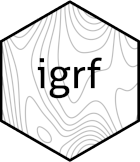

# International Geomagnetic Reference Field 

[](https://github.com/bluegreen-labs/igrf/actions)
[](https://codecov.io/gh/bluegreen-labs/igrf)
[](https://cran.r-project.org/package=igrf)
[](https://cran.r-project.org/package=igrf)
[](https://doi.org/10.5281/zenodo.6527638)

The 13th Generation International Geomagnetic Reference Field (IGRF) implemented as an R package. The `igrf` package provides an R version of the of the original IGRF model in Fortran published by Alken et al. 2021 (available on the NOAA website <https://www.ncei.noaa.gov/products/international-geomagnetic-reference-field>). R outputs have been verified to correspond with the original Fortran code and can be considere equivalent with the exception that values in the R are not rounded before output. For all intents and purposes the data can be considered equivalent.

For full model details I refer to Alken et al. 2021, and the project website where both the original code and a brief model description can be found. The authors of both the R package and the original Fortran code take no responsibility regarding the use of these data within a professional context. For caveats on model use I refer to the health warning on the original project website (<https://www.ngdc.noaa.gov/IAGA/vmod/igrfhw.html>).

## How to cite this package in your article

> Koen Hufkens. (2022). bluegreen-labs/igrf: IGRF CRAN release v1.0 (v1.0). Zenodo. https://doi.org/10.5281/zenodo.6527638

## Installation

### stable release

To install the current stable release use a CRAN repository:

```r
install.packages("igrf")
library("igrf")
```

### development release

To install the development releases of the package run the following
commands:

``` r
if(!require(remotes)){install.packages("remotes")}
remotes::install_github("bluegreen-labs/igrf")
library("igrf")
```

Vignettes are not rendered by default, if you want to include additional
documentation please use:

``` r
if(!require(remotes)){install.packages("remotes")}
remotes::install_github("bluegreen-labs/igrf", build_vignettes = TRUE)
library("igrf")
```

## Use
### Single coordinates

IGRF values can be calculated for a single point using the below call. This will generate a data frame with model values. The routine is relatively fast so looping over a time vector will generate time series fairly quickly. To calculate grids a simple function is provided (see below).

```r
df <- igrf(
  field = "main",
  year = 2000,
  altitude = 2,
  latitude = 0,
  longitude = 0
)
```

### Regular grid

You may generate global maps of the IGRF using the `igrf_grid()` function, setting similar parameters as above while specifying a resolution as decimal degrees of the global grid. Keep in mind that values under 1 (fractions) will take an increasing amount of time and space to store the data.

```r
grid <- igrf::igrf_grid(
  field = "main",
  year = 2000,
  altitude = 2,
  resolution = 5
  )
```

A resulting map can be generated from this data using contour lines from the `metR` package. The full code on how to generate the below figure is provided in the vignette.


## Licensing

The `igrf` package is distributed under a AGPLv3 license, while the IGRF model code resides in the public domain (CC0) made available by Alken et al. (2021). I'm indebted to the the original authors for making model interoperability easy.

## References

- Alken, P., Thebault, E., Beggan, C.D. et al. International Geomagnetic Reference Field: the thirteenth generation. Earth Planets Space 73, 49 (2021). <https://doi.org/10.1186/s40623-020-01288-x>

